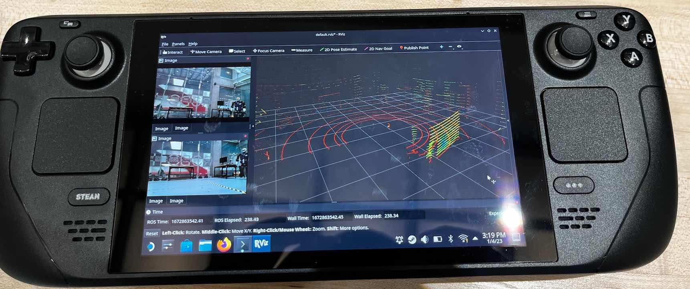
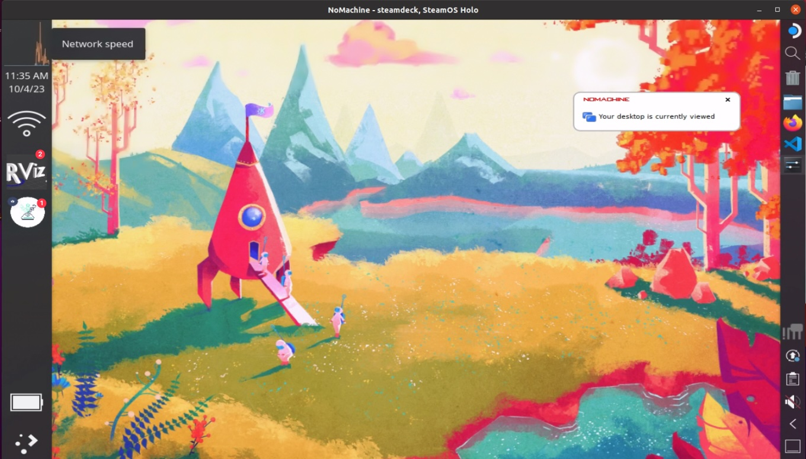

<toc>

# Table of Contents
[*Last generated: Wed  4 Oct 2023 11:52:26 EDT*]
- [**1. Waterloo Steel Robot Launch Instructions :construction:**](#1-Waterloo-Steel-Robot-Launch-Instructions-construction)
  - [1.1 Adlink MXE 211 (SUMMIT + Lidar PC)](#11-Adlink-MXE-211-SUMMIT-Lidar-PC)
    - [1.1.0 Reset Workspace:](#110-Reset-Workspace)
    - [1.1.1 PS Controller:](#111-PS-Controller)
    - [1.1.2 Summit XL Bringup:](#112-Summit-XL-Bringup)
  - [1.2 Jetson Orin (WAM + Vision PC)](#12-Jetson-Orin-WAM-Vision-PC)
    - [1.2.1 WAM:](#121-WAM)
    - [1.2.2 ZED:](#122-ZED)
  - [1.3 Steam Deck Controller](#13-Steam-Deck-Controller)
    - [1.3.1 Launch through Icons:](#131-Launch-through-Icons)
    - [1.3.2 Launch through terminals:](#132-Launch-through-terminals)
      - [1.3.2.1 Launch Pad](#1321-Launch-Pad)
      - [1.3.2.2 Launch Rviz](#1322-Launch-Rviz)
- [**2. Unified Development :construction:**](#2-Unified-Development-construction)
- [**3. Usage Guide With Tool Chain and Workspace:**](#3-Usage-Guide-With-Tool-Chain-and-Workspace)
- [**Appendix A - File Arch**](#Appendix-A-File-Arch)
  - [A.1 xacro and launching](#A1-xacro-and-launching)
  - [A.2 ROS](#A2-ROS)
    - [A.2.1 ROS Profiling](#A21-ROS-Profiling)
      - [a) GDB:](#a-GDB)
      - [b) Valgrind:](#b-Valgrind)
    - [A.2.2 ROS Profiling with rosrun:](#A22-ROS-Profiling-with-rosrun)
  - [A.3 Common Issues:](#A3-Common-Issues)
    - [A.3.1 Error of catkin build: Unable to find source space ....](#A31-Error-of-catkin-build-Unable-to-find-source-space-)

---
</toc>

</img>

# 1. Waterloo Steel Robot Launch Instructions :construction:

1. MXE 211 should auto-launch the summit-xl 
   1. If you need to check status, refer to [1.1 Adlink MXE 211 (SUMMIT + Lidar PC)](#11-Adlink-MXE-211-SUMMIT-Lidar-PC) below.

1. Interfacing on-board computers:

   1. SSH:

      ```bash
      # Jetson:
      ssh uwarl-orin@192.168.1.10
      # Adlink:
      ssh uwarl@192.168.1.11
      # Internal-WAM PC:
      ssh robot@192.168.1.40
      ```


3. All shortcuts came with auto-configuration:

   ```bash
   # sync across multi platform:
   #   - but make sure the config is pointing at the same branch across platforms
   $ sync_latest 
   
   # update (pull recursively in a batch) of the entire workspace with all required submodules (as noted in common.sh) from anywhere
   $ update_ws
   # build ws from anywhere
   $ build_ws
   # source ws from anywhere
   $ src_ws
   # source ~/.zshrc from anywhere
   $ src_zsh
   # cd into workspace from anywhere
   $ cd_ws
   # check wworkspace status from anywhere
   $ check_ws_status
   # cd into robot_configs from anywhere
   $ cd_config
   
   # auto-gen Table of Contents for a specific markdown file
   $ md_toc README.md 
   # auto-gen Table of Contents for a specific directory containing all markdown files
   $ md_toc_dir docs
   ```
   
   

## 1.1 Adlink MXE 211 (SUMMIT + Lidar PC)

### 1.1.0 Reset Workspace:

```bash
$ rm -rf ~/UWARL_catkin_ws
$ cd_config
$ ./scripts/auto-config_UWARL_catkin_ws.zsh
```

### 1.1.1 PS Controller:

```bash
# check driver status
$ systemctl status ds4drv.service
```

### 1.1.2 Summit XL Bringup:

1. Power on the robot, wait for computers to auto-boot

2. Check if default launch successful:

   ```bash
   # SSH into adlink mxe211 (summit)
   $ ssh uwarl@192.168.1.11
   
   # check if summit bringup is successful
   $ systemctl status --user roscorelaunch@waterloo_steel_summit_bringup:waterloo_steel_summit.launch
   
   # stop/restart
   $ systemctl stop/restart --user roscorelaunch@waterloo_steel_summit_bringup:waterloo_steel_summit.launch
   
   # [DEBUG]
   $ journalctl --user --user-unit=roscorelaunch@waterloo_steel_summit_bringup:waterloo_steel_summit.launch > log.txt
   # [DEBUG] - Live Stream:
   $ journalctl --follow --user --user-unit=roscorelaunch@waterloo_steel_summit_bringup:waterloo_steel_summit.launch
   ```


## 1.2 Jetson Orin (WAM + Vision PC)

### 1.2.1 WAM:

```bash
# launch wam node:
$ roslaunch wam_node wam_node.launch

# example commands:
$ rosservice call /wam/go_home                                                                         
$ rosservice call /wam/joint_move "joints:                                                            
- 0.0
- 0.0
- 0.0
- 0.0
- 0.0
- 0.0
- 0.0"
```


### 1.2.2 ZED:

```bash
$ roslaunch zed_wrapper zed.launch
```


## 1.3 Steam Deck Controller



### 1.3.1 Launch through Icons:

> 📓 Icon apps are installed by `uwarl-robot_config` toolchain, and allow us to use the basic interface without keyboard.



- :one:  > **Launch Pad** 
- :two:  > **Rviz Viewer**

### 1.3.2 Launch through terminals:

#### 1.3.2.1 Launch Pad 

```bash
$ roslaunch summit_xl_pad waterloo_steel_summit_deck.launch
```

#### 1.3.2.2 Launch Rviz

```bash
$ rosrun rviz rviz
```


# 2. Unified Development :construction:

- **See up-to-date details from:** [***\*2. ⭐ Unified Development :construction:  [Local PC / Summit / WAM] (Melodic/Noetic):\****](https://github.com/UW-Advanced-Robotics-Lab/uwarl-robot_configs#2--unified-development-construction--local-pc--summit--wam-melodicnoetic)

# 3. Usage Guide With Tool Chain and Workspace:

- **See up-to-date details from:**  [***\*3. ROS UWARL_catkin_ws Usage Guide:\****](https://github.com/UW-Advanced-Robotics-Lab/uwarl-robot_configs#3-ros-uwarl_catkin_ws-usage-guide)

---

# Appendix A - File Arch

## A.1 xacro and launching

[TODO]


## A.2 ROS 

### A.2.1 ROS Profiling

- Reads:
  - [Read More about [Debugging and profiling ROS nodes]](https://subscription.packtpub.com/book/iot-&-hardware/9781783987443/4/ch04lvl1sec25/debugging-and-profiling-ros-nodes)
  - Valgrind:https://valgrind.org
  - https://answers.ros.org/question/28383/time-consumption-profiling/
  - ROS valgrind: https://wiki.ros.org/roslaunch/Tutorials/Roslaunch%20Nodes%20in%20Valgrind%20or%20GDB
    - Kcachegrind: https://wiki.ros.org/roslaunch/Tutorials/Profiling%20roslaunch%20nodes

#### a) GDB:

```bash
$ build_ws -DCMAKE_BUILD_TYPE=Debug

# in roslaunch file:
<launch>
  <node name="wam_node" type="wam_node" pkg="wam_node" output="screen" 
    launch-prefix="gdb -ex run --args"
  />
</launch>
```

#### b) Valgrind:

- Install:

  - ```bash
    $ sudo apt -y install valgrind
    $ sudo apt-get install kcachegrind # visualizer:
    
    #### roslaunch file add prefix:
    <launch>
      <node name="wam_node" type="wam_node" pkg="wam_node" output="screen" 
        launch-prefix="valgrind --tool=callgrind  
          --log-file=/home/uwarl-orin/JX_Logs/valgrind.log 
          --callgrind-out-file='/home/uwarl-orin/JX_Logs/callgrind.wam_node.%p'"
      />
    </launch>
    ```

- Instructions:

  - ```bash
    $ build_ws -DCMAKE_BUILD_TYPE=Debug
    
    # enable core dumps:
    $ ulimit -a	# check limits
    $ ulimit -c unlimited  # unlimited
    
    # allow core dumps to be created:
    $ sudo echo 1 > /proc/sys/kernel/core_uses_pid
    ```


### A.2.2 ROS Profiling with rosrun:

Instructions:

- ```bash
  # make sure build with debug:
  $ build_ws -DCMAKE_BUILD_TYPE=Debug
  # OR:
  $ build_ws_debug
  
  # normal program run:
  $ rosrun vins vins_node $cam_config_file_path
  
  # run with valgrind:
  $ rosrun_valgrind vins vins_node $cam_config_file_path
  
  # -> check error causing memory dump:
  $ cat $HOME/valgrind_log.txt
  ##### OUTPUT:
  ==134393== Memcheck, a memory error detector
  ==134393== Copyright (C) 2002-2017, and GNU GPL'd, by Julian Seward et al.
  ==134393== Using Valgrind-3.15.0 and LibVEX; rerun with -h for copyright info
  ==134393== Command: /home/parallels/UWARL_catkin_ws/devel/lib/vins/vins_node /home/parallels/UWARL_catkin_ws/src/vins-research-pkg/VINS-Fusion/config/uwarl_d455/mono_rgb_imu_config_dual.yaml
  ==134393== Parent PID: 134030
  ==134393==
  ==134393== Thread 7:
  ==134393== Invalid read of size 8
  ==134393==    at 0x4936B20: shared_count (shared_count.hpp:433)
  ==134393==    by 0x4936B20: shared_ptr (shared_ptr.hpp:422)
  ==134393==    by 0x4936B20: FeatureTracker::trackImage(double, cv::Mat const&, cv::Mat const&) (feature_tracker.cpp:199)
  ==134393==    by 0x48B184B: Estimator::inputImage(double, cv::Mat const&, cv::Mat const&) (estimator.cpp:167)
  ==134393==    by 0x19BCAB: sync_process() (rosNodeTest.cpp:126)
  ==134393==    by 0x56B2FAB: ??? (in /usr/lib/aarch64-linux-gnu/libstdc++.so.6.0.28)
  ==134393==    by 0x4E72623: start_thread (pthread_create.c:477)
  ==134393==    by 0x596B49B: thread_start (clone.S:78)
  ==134393==  Address 0x8 is not stack'd, malloc'd or (recently) free'd
  ==134393==
  ```

- ```bash
  # options:
  $ rosrun_gdb
  $ rosrun_valgrind
  ```


## A.3 Common Issues:

### A.3.1 Error of catkin build: Unable to find source space ....

```bash
rm -rf ~/.catkin_tools
```

- [Ref](https://github.com/catkin/catkin_tools/issues/425)


<eof>

---
[*> Back To Top <*](#Table-of-Contents)
</eof>