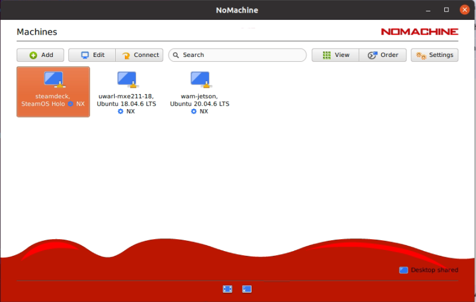
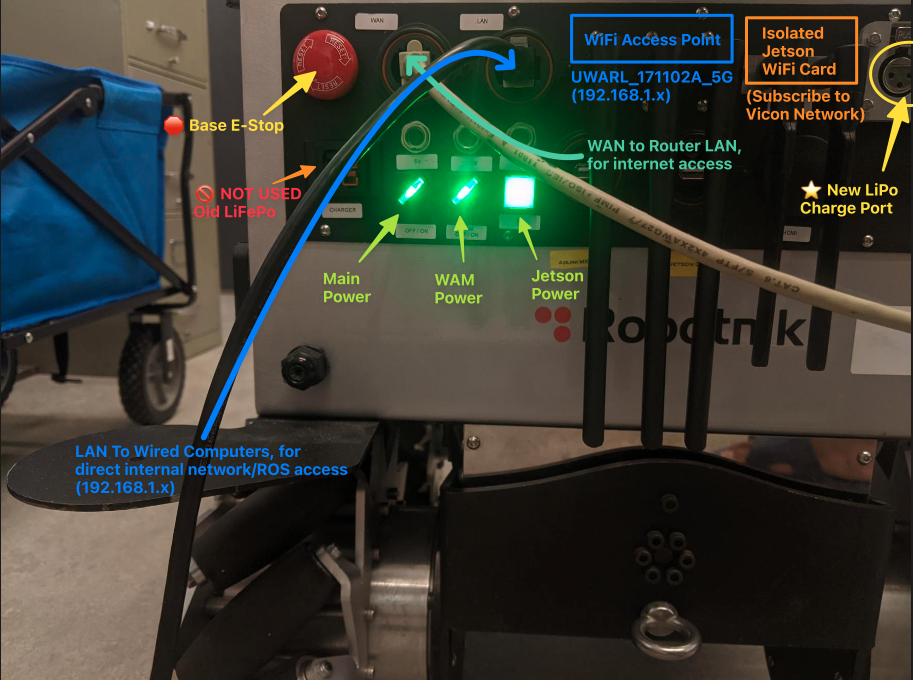
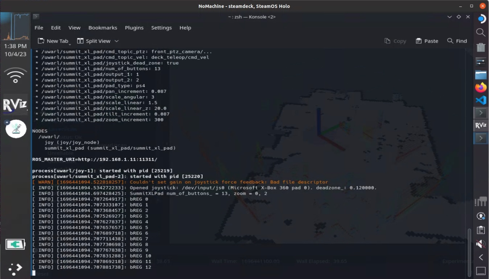
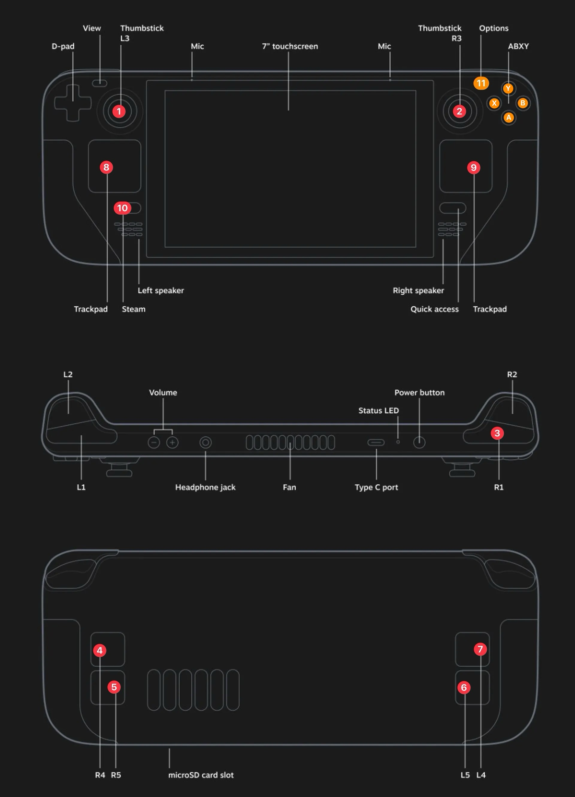

<toc>

# Table of Contents
[*Last generated: Wed  4 Oct 2023 15:34:20 EDT*]
- [**0. General:**](#0-General)
  - [0.1 Unified Development :construction:](#01-Unified-Development-construction)
  - [0.2 Usage Guide With Tool Chain and Workspace:](#02-Usage-Guide-With-Tool-Chain-and-Workspace)
  - [0.3 Networking:](#03-Networking)
    - [0.3.1 Access with SSH:](#031-Access-with-SSH)
    - [0.3.2 Access with NoMachine:](#032-Access-with-NoMachine)
    - [0.3.3 External Network with Ethernet](#033-External-Network-with-Ethernet)
      - [0.3.3.a [Optional] WAN <--> Router LAN: Internet Access in Local Network](#033a-Optional-WAN-Router-LAN-Internet-Access-in-Local-Network)
      - [0.3.3.b [Optional] LAN <--> Computer: Direct Local Network Access](#033b-Optional-LAN-Computer-Direct-Local-Network-Access)
      - [0.3.3.c [Optional] Robot WiFi <--> Computer: Direct Local Network Access](#033c-Optional-Robot-WiFi-Computer-Direct-Local-Network-Access)
- [**1. Power On Instruction:**](#1-Power-On-Instruction)
  - [1.1 Robot Back Panel Layout](#11-Robot-Back-Panel-Layout)
  - [1.2 Powering on the robot](#12-Powering-on-the-robot)
    - [1.2.1 Turn on the robot (Main Power Switch)](#121-Turn-on-the-robot-Main-Power-Switch)
    - [1.2.2 Turn on the arm (WAM Power Switch)](#122-Turn-on-the-arm-WAM-Power-Switch)
  - [1.3 Use Steam Deck Controller:](#13-Use-Steam-Deck-Controller)
    - [1.3.1 Power on the steam deck controller](#131-Power-on-the-steam-deck-controller)
    - [1.3.2 Connect to the Robot Wifi `UWARL_171102_5G`](#132-Connect-to-the-Robot-Wifi-UWARL_171102_5G)
    - [1.3.3 Launch Controller Apps](#133-Launch-Controller-Apps)
      - [1.3.3.a) (:one:) Joystick Controller to control Base:](#133a-one-Joystick-Controller-to-control-Base)
      - [1.3.3.b) (:two:) Rviz Viewer:](#133b-two-Rviz-Viewer)
  - [1.4 Power off Robot Sequence ‼️](#14-Power-off-Robot-Sequence-)
- [**2. Adlink MXE 211 (SUMMIT + Lidar PC)**](#2-Adlink-MXE-211-SUMMIT-Lidar-PC)
  - [2.1 General:](#21-General)
    - [2.1.0 Reset Workspace:](#210-Reset-Workspace)
  - [2.2 Summit XL Bringup:](#22-Summit-XL-Bringup)
- [**3. Jetson Orin (WAM + Vision PC)**](#3-Jetson-Orin-WAM-Vision-PC)
  - [3.1 WAM Node:](#31-WAM-Node)
  - [3.2 Multiple Intel Cameras:](#32-Multiple-Intel-Cameras)
- [**4. Steam Deck Controller**](#4-Steam-Deck-Controller)
  - [4.1 Deck Button Layout](#41-Deck-Button-Layout)
  - [4.2 Deck Button Functions](#42-Deck-Button-Functions)
    - [4.2.a) Move Summit:](#42a-Move-Summit)
    - [4.2.b) Steam Arch Linux:](#42b-Steam-Arch-Linux)
  - [4.3 Control Summit Base Platform:](#43-Control-Summit-Base-Platform)
    - [4.3.1 Launching through Icons:](#431-Launching-through-Icons)
    - [4.3.2 Launch through terminals:](#432-Launch-through-terminals)
      - [1.3.2.1 Launch Pad](#1321-Launch-Pad)
      - [1.3.2.2 Launch Rviz](#1322-Launch-Rviz)
- [**Appendix A - Utilities**](#Appendix-A-Utilities)
  - [A.1 xacro and launching](#A1-xacro-and-launching)
  - [A.2 ROS](#A2-ROS)
    - [A.2.1 ROS Testing](#A21-ROS-Testing)
    - [A.2.2 ROS Profiling](#A22-ROS-Profiling)
      - [a) GDB:](#a-GDB)
      - [b) Valgrind:](#b-Valgrind)
    - [A.2.3 ROS Profiling with rosrun:](#A23-ROS-Profiling-with-rosrun)
- [**Appendic B - Troubleshoot:**](#Appendic-B-Troubleshoot)
  - [B.1 Error of catkin build:](#B1-Error-of-catkin-build)
    - [B.1.1 Unable to find source space ....](#B11-Unable-to-find-source-space-)
  - [B.2 Hardware](#B2-Hardware)
    - [B.2.1 Deck Controller Cannot Launch:](#B21-Deck-Controller-Cannot-Launch)
- [**C. System Architecture:**](#C-System-Architecture)

---
</toc>

# 0. General:

1. MXE 211 should auto-launch the summit-xl 

## 0.1 Unified Development :construction:

- **See up-to-date details from:** [***\*2. ⭐ Unified Development :construction:  [Local PC / Summit / WAM] (Melodic/Noetic):\****](https://github.com/UW-Advanced-Robotics-Lab/uwarl-robot_configs#2--unified-development-construction--local-pc--summit--wam-melodicnoetic)

## 0.2 Usage Guide With Tool Chain and Workspace:

- **See up-to-date details from:**  [***\*3. ROS UWARL_catkin_ws Usage Guide:\****](https://github.com/UW-Advanced-Robotics-Lab/uwarl-robot_configs#3-ros-uwarl_catkin_ws-usage-guide)

## 0.3 Networking:

1. `UWARL_Robot_5G`: **Lab Network** is a (AP:access point) wifi broadcasted by the Lab router to distribute secure networks for internet access (**192.168.5.x**)
2. `UWARL_17110A_5G`: **Robot Network Wifi** is a (AP: access point) wifi broadcasted by the an on-robot router to distribute ROS network the wireless 5GHz network (**192.168.1.x**)
3. (**Jetson Wifi**): is an isolated wifi card to allow Jetson connecting to an explicit DHCP access point
   1. The network will be isolated from the robot, only jetson will be seeing it, (unless forwarded to the local robot network through Jetson network configuration.)
   2. Use Case: logging Ground Truth data from Vicon via UDP streaming, and a ROS node on Jetson will format and broadcast the data in the local ROS network  

### 0.3.1 Access with SSH:

> Need to connect the laptop to the **robot network** via **LAN or Wireless**

```bash
# Jetson:
ssh uwarl-orin@192.168.1.10
# Adlink:
ssh uwarl@192.168.1.11
# Internal-WAM PC: (if ethernet is plugged in)
ssh robot@192.168.1.40
```

### 0.3.2 Access with NoMachine:

> Need to connect the laptop to the **robot network** via **LAN or Wireless**



### 0.3.3 External Network with Ethernet

#### 0.3.3.a [Optional] WAN <--> Router LAN: Internet Access in Local Network

- if you want internet access (eg, update local repository), please connect to:
  - WAN port of the robot <-----> LAN port of the Router

#### 0.3.3.b [Optional] LAN <--> Computer: Direct Local Network Access

1. if you want Remote access with **AnyDesk** to the robot network,

   - you may want your PC connecting to the Lab Wifi

   - and connect the ethernet from robot LAN to Laptop

#### 0.3.3.c [Optional] Robot WiFi <--> Computer: Direct Local Network Access

1. Alternatively,
   - you can connect PC to Lab Network wireless via wifi
   - and connect your PC to Global Internet (Lab Router) via ethernet cable

# 1. Power On Instruction:

## 1.1 Robot Back Panel Layout



## 1.2 Powering on the robot

### 1.2.1 Turn on the robot (Main Power Switch)

- by twisting power knobs for Base

- we should see the green button (for jetson pc) is lighting on
- fan spinning, and everything should be powered except WAM

### 1.2.2 Turn on the arm (WAM Power Switch)

- by twisting power knobs for WAM

- Make sure the LED panel is powered on, and will show ERROR as the WAM has not been calibrated and launched by default

## 1.3 Use Steam Deck Controller:

### 1.3.1 Power on the steam deck controller

- By default it will boot up into game controller interface, 
  - if so, switch to the desktop mode
- Prefer in sleep mode, so never turn off deck, but leave it charge and put into sleep mode (screen off)

### 1.3.2 Connect to the Robot Wifi `UWARL_171102_5G`

- We should now be able to launch the controller

### 1.3.3 Launch Controller Apps 

> [!IMPORTANT] 
> ⚠️ Before launching, press and release the **[Summit Base E-Stop]** to ensure the summit base is **NOT** in safety mode. 
>
> - Otherwise, try to ssh into summit PC, and `$ summit_systemctl status` to check system status
>   - See details @ https://github.com/UW-Advanced-Robotics-Lab/lab-wiki/wiki/Waterloo-Steel%3APlatform-Setup-Hardware#142-Setup-Auto-launch-at-the-boot

1. Launch the joystick controller by touching **[Launch UWARL Summit Controller]** App Icon
   - 🚨 If the controller app quits after launching,  [[A.1 Deck Controller Cannot Launch:](#A1-Deck-Controller-Cannot-Launch)]
   - **[OPTIONAL]** :notebook: You may launch the rviz by touching **[Launch Rviz]** App Icon

> 📓 Icon apps are installed by `uwarl-robot_config` toolchain, and allow us to use the basic interface without keyboard.


#### 1.3.3.a) (:one:) Joystick Controller to control Base:



#### 1.3.3.b) (:two:) Rviz Viewer:


## 1.4 Power off Robot Sequence ‼️ 

> :warning: If possible, ssh into the jetson and summit PC to shutdown the PC first
>
> ```bash
> # jetson:
> $ ssh uwarl-orin@192.168.1.10
> # summit:
> $ ssh ssh uwarl@192.168.1.11
> ```

1. Long Press Green Button to power off the **Jetson PC**
2. Turn off the **WAM** power rails 
3. Turn off the **overall power rails** 
4. Turn off the screen of the steam deck by pressing power button briefly once, and put into charger.
   - we dont want a reboot of steam deck


# 2. Adlink MXE 211 (SUMMIT + Lidar PC)

## 2.1 General:

- PS4 Controller is no longer launched by default, as the rs4 node is being launched on **[Steam Deck]**

### 2.1.0 Reset Workspace:

```bash
$ rm -rf ~/UWARL_catkin_ws
$ cd_config
$ ./scripts/auto-config_UWARL_catkin_ws.zsh
```

## 2.2 Summit XL Bringup:

1. Power on the robot, wait for computers to auto-boot

2. Check if default launch successful:

   ```bash
   # SSH into adlink mxe211 (summit)
   $ ssh uwarl@192.168.1.11
   
   # check if summit bringup is successful
   $ systemctl status --user roscorelaunch@waterloo_steel_summit_bringup:waterloo_steel_summit.launch
   
   # stop/restart
   $ systemctl stop/restart --user roscorelaunch@waterloo_steel_summit_bringup:waterloo_steel_summit.launch
   
   # [DEBUG]
   $ journalctl --user --user-unit=roscorelaunch@waterloo_steel_summit_bringup:waterloo_steel_summit.launch > log.txt
   # [DEBUG] - Live Stream:
   $ journalctl --follow --user --user-unit=roscorelaunch@waterloo_steel_summit_bringup:waterloo_steel_summit.launch
   ```

# 3. Jetson Orin (WAM + Vision PC)

## 3.1 WAM Node:

```bash
# launch wam node:
$ roslaunch wam_node wam_node.launch

# example commands:
$ rosservice call /wam/go_home                                                                         
$ rosservice call /wam/joint_move "joints:                                                            
- 0.0
- 0.0
- 0.0
- 0.0
- 0.0
- 0.0
- 0.0"
```

## 3.2 Multiple Intel Cameras:

```bash
$ ssh uwarl-orin@192.168.1.10
$ roslaunch waterloo_steel_supervisor multi_intel_camera.launch
```


# 4. Steam Deck Controller

## 4.1 Deck Button Layout



## 4.2 Deck Button Functions

### 4.2.a) Move Summit:

- Launch the joystick controller by touching **[Launch UWARL Summit Controller]** App Icon

- Button Layouts:
  - Hold :three: **[R1]**  + Move Up/Down :one: **[L3]** : Forward/Reverse
  - Hold :three: **[R1]**  + Move Left/Right :two: **[R3]** : CCW/CW
  - Hold :three: **[R1]**  + Press **(11)** **[Options]** : Omni / Skid Mode

### 4.2.b) Steam Arch Linux:

- :four: **[R4]** : Scroll Up
- :five: **[R5]** : Scroll Down
- :six: **[L5]** : Left Mouse Click for Mouse Menus
- :seven: **[L4]** : Enter 
- :eight: **[Left Trackpad]**  Button Click : Arrow Key Up/Down/Left/Right
- 9️⃣ **[Right Trackpad]** : Mouse Move +  Mouse Right Click
- :keycap_ten: **[Steam]** : Menu Selection ---> Used to switch between Steam OS / ArchLinux Mode + Power/Restart

## 4.3 Control Summit Base Platform:


### 4.3.1 Launching through Icons:

- :one:  > **Launch Pad** 
- :two:  > **Rviz Viewer**


### 4.3.2 Launch through terminals:

#### 1.3.2.1 Launch Pad 

```bash
$ roslaunch summit_xl_pad waterloo_steel_summit_deck.launch
```

#### 1.3.2.2 Launch Rviz

```bash
$ rosrun rviz rviz
```


---

# Appendix A - Utilities

## A.1 xacro and launching

[TODO]


## A.2 ROS 

### A.2.1 ROS Testing

```bash
$ rosnode ping -c 4 rosout
rosnode: node is [/rosout]
pinging /rosout with a timeout of 3.0s
xmlrpc reply from http://ann:46635/     time=1.195908ms
xmlrpc reply from http://ann:46635/     time=1.123905ms
xmlrpc reply from http://ann:46635/     time=1.144886ms
xmlrpc reply from http://ann:46635/     time=1.137018ms
ping average: 1.150429ms
```

- http://wiki.ros.org/rosnode

### A.2.2 ROS Profiling

- Reads:
  - [Read More about [Debugging and profiling ROS nodes]](https://subscription.packtpub.com/book/iot-&-hardware/9781783987443/4/ch04lvl1sec25/debugging-and-profiling-ros-nodes)
  - Valgrind:https://valgrind.org
  - https://answers.ros.org/question/28383/time-consumption-profiling/
  - ROS valgrind: https://wiki.ros.org/roslaunch/Tutorials/Roslaunch%20Nodes%20in%20Valgrind%20or%20GDB
    - Kcachegrind: https://wiki.ros.org/roslaunch/Tutorials/Profiling%20roslaunch%20nodes

#### a) GDB:

```bash
$ build_ws -DCMAKE_BUILD_TYPE=Debug

# in roslaunch file:
<launch>
  <node name="wam_node" type="wam_node" pkg="wam_node" output="screen" 
    launch-prefix="gdb -ex run --args"
  />
</launch>
```

#### b) Valgrind:

- Install:

  - ```bash
    $ sudo apt -y install valgrind
    $ sudo apt-get install kcachegrind # visualizer:
    
    #### roslaunch file add prefix:
    <launch>
      <node name="wam_node" type="wam_node" pkg="wam_node" output="screen" 
        launch-prefix="valgrind --tool=callgrind  
          --log-file=/home/uwarl-orin/JX_Logs/valgrind.log 
          --callgrind-out-file='/home/uwarl-orin/JX_Logs/callgrind.wam_node.%p'"
      />
    </launch>
    ```

- Instructions:

  - ```bash
    $ build_ws -DCMAKE_BUILD_TYPE=Debug
    
    # enable core dumps:
    $ ulimit -a	# check limits
    $ ulimit -c unlimited  # unlimited
    
    # allow core dumps to be created:
    $ sudo echo 1 > /proc/sys/kernel/core_uses_pid
    ```


### A.2.3 ROS Profiling with rosrun:

Instructions:

- ```bash
  # make sure build with debug:
  $ build_ws -DCMAKE_BUILD_TYPE=Debug
  # OR:
  $ build_ws_debug
  
  # normal program run:
  $ rosrun vins vins_node $cam_config_file_path
  
  # run with valgrind:
  $ rosrun_valgrind vins vins_node $cam_config_file_path
  
  # -> check error causing memory dump:
  $ cat $HOME/valgrind_log.txt
  ##### OUTPUT:
  ==134393== Memcheck, a memory error detector
  ==134393== Copyright (C) 2002-2017, and GNU GPL'd, by Julian Seward et al.
  ==134393== Using Valgrind-3.15.0 and LibVEX; rerun with -h for copyright info
  ==134393== Command: /home/parallels/UWARL_catkin_ws/devel/lib/vins/vins_node /home/parallels/UWARL_catkin_ws/src/vins-research-pkg/VINS-Fusion/config/uwarl_d455/mono_rgb_imu_config_dual.yaml
  ==134393== Parent PID: 134030
  ==134393==
  ==134393== Thread 7:
  ==134393== Invalid read of size 8
  ==134393==    at 0x4936B20: shared_count (shared_count.hpp:433)
  ==134393==    by 0x4936B20: shared_ptr (shared_ptr.hpp:422)
  ==134393==    by 0x4936B20: FeatureTracker::trackImage(double, cv::Mat const&, cv::Mat const&) (feature_tracker.cpp:199)
  ==134393==    by 0x48B184B: Estimator::inputImage(double, cv::Mat const&, cv::Mat const&) (estimator.cpp:167)
  ==134393==    by 0x19BCAB: sync_process() (rosNodeTest.cpp:126)
  ==134393==    by 0x56B2FAB: ??? (in /usr/lib/aarch64-linux-gnu/libstdc++.so.6.0.28)
  ==134393==    by 0x4E72623: start_thread (pthread_create.c:477)
  ==134393==    by 0x596B49B: thread_start (clone.S:78)
  ==134393==  Address 0x8 is not stack'd, malloc'd or (recently) free'd
  ==134393==
  ```

- ```bash
  # options:
  $ rosrun_gdb
  $ rosrun_valgrind
  ```

# Appendic B - Troubleshoot:

## B.1 Error of catkin build: 

### B.1.1 Unable to find source space ....

```bash
rm -rf ~/.catkin_tools
```

- [Ref](https://github.com/catkin/catkin_tools/issues/425)

## B.2 Hardware

### B.2.1 Deck Controller Cannot Launch:

🚨 If the controller app quit after launching, it is likely due to the following issues:

 1.  The deck is not connected to summit wifi "*UWARL_171102A_5G*"

     > 🛠️ Connect to the wifi manually at the status bar

 2.  The summit is not hardware ready:

     > 🛠️ Please reset (engage and release) the E-Stop at the rear of the SUMMIT base

 3.  There is no ros core in the network OR any other detailed issues → The Summit Base ROS Controller and ROS Core were not launched successfully nor enabled:

     > 🛠️ Please SSH into the summit base and troubleshoot from there:
     >
     > ```bash
     > # SSH into adlink mxe211 (summit)
     > $ ssh uwarl@192.168.1.11
     > 
     > # check if summit bringup is successful
     > $ systemctl status --user roscorelaunch@waterloo_steel_summit_bringup:waterloo_steel_summit.launch
     > 
     > # [DEBUG] - print out last msg (double-check time-stamp):
     > $ journalctl --follow --user --user-unit=roscorelaunch@waterloo_steel_summit_bringup:waterloo_steel_summit.launch.service > log.txt
     > # [DEBUG] - Live Stream:
     > $ journalctl --follow --user --user-unit=roscorelaunch@waterloo_steel_summit_bringup:waterloo_steel_summit.launch.service
     > 
     > # stop/restart
     > $ systemctl stop --user roscorelaunch@waterloo_steel_summit_bringup:waterloo_steel_summit.launch
     > $ systemctl restart --user roscorelaunch@waterloo_steel_summit_bringup:waterloo_steel_summit.launch
     > 
     > # You may want to check if the workspace is at the right target, and built successfully:
     > $ check_ws_status
     > $ build_ws
     > $ src_all
     > ```


# C. System Architecture:

</img>


<eof>

---
[*> Back To Top <*](#Table-of-Contents)
</eof>